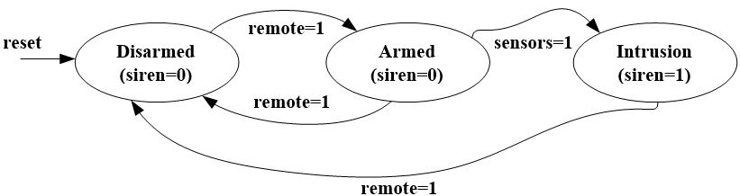
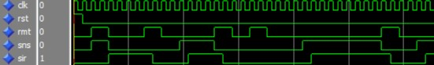

# FSM_CarAlarm

Finite-State Machine Design of a Simple Car Security Alarm on FPGA

## Information

This is a VHDL project for DSD-I1* a Cyclone IV FPGA made in Quartus 18.1 and is based in the example of the book Pedroni 2008.

**Diagram**:  

**Behavioral VHDL code**: FSM_CarAlarm.vhd  
**Testbench VHDL code**: FSM_CarAlarm_tb.vhd  

**Modelsim**:  

*Note: DSD-i1: A Mixed Functionality Development Board Geared Towards Digital Systems Design Education [DOI:10.1109/DSD.2019.00032](https://ieeexplore.ieee.org/document/8875176)

## Licence

Copyright (c) 2019 Stavros Kalapothas (aka Stevaras) <stavros@ubinet.gr>.
It is free software, and may be redistributed under the terms of the GNU Licence.
